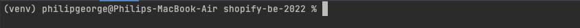
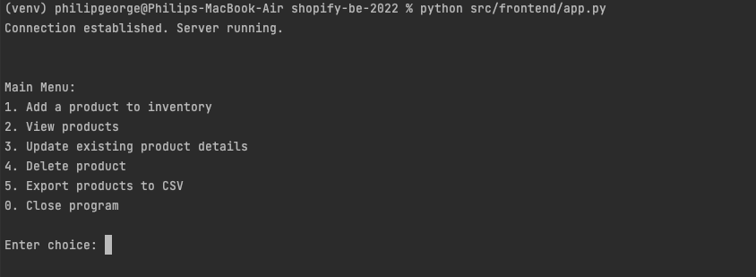
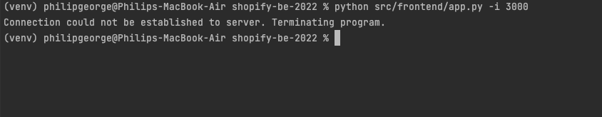

# Shopify Backend Intern Developer Challenge 2022
My implementation of the Shopify Backend Intern Developer Challenge for 2022

## Code Walk-through
The developer document for the project can be found at this [link](DeveloperDocument.pdf). It provides a brief walk-through of:
1. Architecture
2. API Documentation

## How to Run the Application

### Install Python
This application requires python 3.8.9 or later. Depending on the number of python versions installed on your system, you may need to specifically use the commands `python3` and `pip3` instead of `python` and `pip` in the steps below.

### Clone the project
1. Open terminal on macOS. The following commands can also be executed on command prompt in Windows.
2. Navigate to the folder where your project needs to be stored and run the following commands:

```
$ git clone https://github.com/philipgeorge94/shopify-be-2022.git
$ cd shopify-be-2022
```

### Create and activate virtual environment
1. Ensure you're currently in the shopify-be-2022 folder after cloning the project as above, and run the following.
```
$ python -m venv venv 
$ source venv/bin/activate
$ pip install -r requirements.txt
$ pwd
```
2. Run the following, replacing the `<PATH>` with the path obtained from the `pwd` command (`cd` on Windows)
```
$ export PYTHONPATH="${PYTHONPATH}:<PATH>"
```
### Run the Server
First we will run the backend Flask server and establish a connection to the MongoDB database.

1. From my Shopify application, open the **auth.pdf**  file to obtain `<DB_PASSWORD>` required in Step 2 below.
2. Execute the following command. `-p <DB_PASSWORD>` is a required argument. `-i <PORT>` is optional; by default it is 8000. If that port is being used by another process, please input another port such as 3000, 5000 etc. Note the port used here: we will need it to run the frontend application

```
$ python src/backend/server.py -p <DB_PASSWORD> -i <PORT>
```

3. The server should be running successfully now. If not, it is likely due to an invalid or unavailable port assignment. In that case, please stop the server with  `CMD+C` (`Ctrl+C` for Windows) and run the previous command again with a valid port argument
4. If the server cannot connect to the DB, it will terminate. In that case, please recheck your password entered in the previous step.

### Run the Frontend Application
1. Open a new Terminal tab. **Keep the terminal (or command prompt) tab from the previous steps open.**
2. By default, the new Terminal should open in `/your/path/shopify-be-2022`, and the shell should be the activated `venv` virtual environment. On macOS, this is identifiable with a '(venv)' prefix to the prompt as shown below:</br> </br>
3. **If this is not the case**, then navigate to `/your/path/shopify-be-2022` and run the `source venv/bin/activate` command again
4. Since we've opened a new shell instance, we need to set the `$PYTHONPATH` again, even if the virtual environment is still active.
5. Use `pwd` as before to obtain the current `<PATH>` and run the following
```
$ export PYTHONPATH="${PYTHONPATH}:<PATH>"
```
6. Run the following. The `-i <PORT>` argument is again optional, and is 8000 by default. You need to specify the required value only if you ran the backend server on a different port. 
```
$ python src/frontend/app.py -i <PORT>
```
7. The application should now run in the terminal, and display the following: </br> </br> 
8. If there is an error such as the following, it is likely due to an incorrect port being specified. Check the backend server for the correct port, and run the above command again. </br> </br> 


10. You can interact with the inventory using console input.
11. The implemented **"Export Products to CSV"** functionality places the downloaded files in the `/downloads` folder.

## Folder Structure
1. `/downloads`: Contains the .csv files of product information downloaded by the user.
2. `/server_file_storage`: In a real scenario, the user would not be able to access this folder. However, since our backend Flask server is running on the same machine for this mock set-up, this stores the generated .csv files which are then sent by the API to the user.
3. `/src`: contains the source code
4. `/requirements.txt`
5. `/README.md`
6. Image files required for the Readme file

## Best Programming Practices followed 
1. **Client-Server Architecture**: Interaction between Python frontend and Python backend follows a Client-Server Architecture pattern.
2. **Model-View-Controller Architecture**: The Python Flask backend follows an Model-View-Controller Architecture Pattern.
3. **Modularity and Reusability: **: The code has a package structure that shows modularity. This has enabled reusability across functionalities.
4. **Encapsulation**: Encapsulation has been achieved as the code is organized into classes
5. **Type Safety / Exception Handling**: Exception handling has been included using try/except/raise blocks. 
6. **Version Control**: From the beginning of the project, **Git** has been used as a version control system.
7. **Debuggability**: Logging statements have been added to ensure debuggability in the server.


